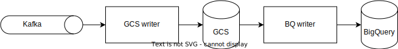

[](http://unmaintained.tech/)

This project is licensed under the MIT License - see the [LICENSE](./LICENSE) file for details.

# Kafka BigQuery Express

System to copy data from Kafka to BigQuery, safely and cost-effectively.


## Features

* Reads Avro messages using Confluent's 5-byte schema-id prefix convention from Kafka.
* Fetches the Avro schema from a Confluent schema registry.
* Dynamically determines the destination dataset/table name.
* Can enrich the message with additional information, e.g. an event date for date partitioning in BigQuery.
* Zero costs for loading data in BigQuery.
* Scales to many billions of messages per day.
* Http endpoint for health checks and Prometheus metrics scraping.

We consider this project a showcase for Scala and ZIO's programming model. It shows that you can write complicated
asynchronous programs in a functional style, while still being fast, cost-effective and have clean readable code.

This project is directly derived from a service that Adevinta runs in production, but with all Adevinta specific
features removed. The removal process might have introduced bugs. If you find a bug, please tell us and we will probably
fix it. Otherwise, as we already have our internal version, we do not intend to maintain this project. In case you
create a fork and will maintain it, please let us know and we can document that in this readme.

## Outline of the process



### Service gcs-writer

This service can scale horizontally. However, as this is a Kafka consumer, we recommend manual scaling only.

- Each event goes through these steps:
  - Read the events from managed kafka. The topics are configured in file `source-topics.txt`.
  - Extract record headers and deserialize record value to an Avro `GenericRecord`, results in a `ParsedMessage`.
  - Extract information from parsed contents (e.g. eventDate and destination table), results in an `EnrichedMessage`.
  - Write the enriched message to an Avro file on GCS. The file name contains the following
    information: `$topic.$partition.$dataset.$table.$schemaId.$firstOffset.avro`.
  - The avro files are written for ~5 minutes and then closed. When more events arrive, a new file is opened.
  - Directly after the avro file is closed, a companion 'done' file is written. The done file has a similar name but
    adds the last offset: `$topic.$partition.$dataset.$table.$schemaId.$firstOffset.$lastOffset.done`. Done files are
    empty, only their name carries information.
- When the Kafka broker _revokes_ a partition:
  - Wait 20 seconds (`maxRebalanceDuration`), this should be enough for the pod to complete writing whatever was
    pre-fetched from Kafka.
- When the Kafka broker _assigns_ a new partition:
  - Wait 5 seconds (this allows the previous pod to properly close).
  - Delete avro files for the assigned partition that do not have a companion done file.
  - Find the starting offset by listing all done files for the assigned partition and find the highest end offset. If
    none found, read the partition from the earliest available offset.

Note: gcs-writer does _not_ commit to Kafka. Instead, we use the done files to keep track of processed offsets.

The whole process can be [bootstrapped](#bootstrap-operations) from a certain offset by manually generating done files.

### Service bq-writer

This service is a singleton.

⚠️ Failure to run this service as a singleton will result in duplicate data in BigQuery.

- Every 15 minutes:
  - Collect all avro files (that have a companion done file) that have the same destination table.
  - Select those files that can be loaded together. BigQuery extracts the schema from the alphabetically last file
    in the set. This mechanism is not guaranteed to take the latest schema. Therefore, when the set contains files
    with different schema, we only take those files that have the lowest schema id. In addition, we only select the
    first 10k files (a limit of BigQuery). Non-selected files are processed in the next cycle (15 minutes later).
  - Generate job descriptions, one per destination table. A job is defined by a globally unique job id (we use a
    random UUID) and a list of avro files. The id must be globally unique so that we can submit the job to BigQuery
    twice. If the second attempt fails, we know the job was already started.
  - Write a state file with the job descriptions on GCS.
  - Start the jobs described in the step above by submitting them to BigQuery.
- At startup:
  - Read the state file with job descriptions.
  - If any of these jobs cannot be found (meaning the previous service instance crashed before starting these jobs),
    start those jobs.
- Every 2 minutes:
  - Check the status of started jobs.
  - For a successful job:
    - delete the avro files that were loaded into BigQuery (not the companion done files),
    - remove the job from the state and update the state file on GCS.
- Every 9 minutes:
  - Delete done files that are no longer needed. A done file is no longer needed when:
    - the companion avro file was already deleted (indicating it was loaded into BigQuery) AND
    - a done file with a higher begin and end offset exists for the same topic-partition exists OR the done file is
      more than a month old (though we could go much lower since the topic retention is 4 days).

      The effect is that we keep at least 1 done file per partition. This allows the gcs-writer to find a safe offset to
      start consuming from.

### Notes

Note that the process is designed such that events can not go missing nor can be duplicated. These properties rely on
the following assumptions:

- When a process gets killed, any open GCS files are silently deleted (this is true because they only become visible
  after closing them).
- When a partition is revoked, the pod has enough time to complete writing all events that were already fetched from
  Kafka. This assumption could be violated when for some reason write throughput to GCS is heavily reduced.
- When a pod is shut down, it has enough time to complete writing all events that were already fetched from Kafka.
- Once a done file is created, the avro file may not be deleted until it has been loaded into BigQuery.
- Deleting files: first the avro file, then the companion done file.
- If the avro file is written but the done file not, the new pod will delete the avro file and rebuild it. For this to
  work, the new pod must be sure that the done file is not about to be written. This is made very likely by giving the
  old pod 20s to complete the revoked partition, and waiting 5s in the new pod after a partition is assigned.
- At most one bigquery-writer instance is running at any time. Since a new pod only starts to actually do something
  after 15 minutes, a short run overlap is okay. Failure to run this service as a singleton will result in duplicate
  data.

## HTTP endpoints

| Endpoint       | Method | Description                                               |
|----------------|--------|-----------------------------------------------------------|
| `/`            | GET    | Just a hello!                                             |
| `/healthcheck` | GET    | Always responds with a 200 OK                             |
| `/version`     | GET    | Build information (see `buildInfoSettings` in `build.sbt` |
| `/metrics`     | GET    | Prometheus metrics                                        |

## Available metrics

| Name                              | Type      | Description                                                            |
|-----------------------------------|-----------|------------------------------------------------------------------------|
| gcswriter_filecount               | Counter   | Number of Avro files opened                                            |
| gcswriter_closedfilecount         | Counter   | Number of Avro files closed                                            |
| gcswriter_avrofilesdeletedcounter | Counter   | Deleted .avro files at startup that lacked a corresponding .done file. |
| gcswriter_consumedmessages        | Counter   | Number of messages read from Kafka                                     |
| gcswriter_publishbatchsize        | Histogram | Publish batch size                                                     |
| gcswriter_latency                 | Histogram | Latency of processing a message                                        |
| gcswriter_bytes_written           | Counter   | Avro bytes written to GCS (before compression) per dataset             |

| Name                         | Type      | Description                                                                                |
|------------------------------|-----------|--------------------------------------------------------------------------------------------|
| bqwriter_submittedjobstobq   | Counter   | Number of BigQuery load jobs submitted                                                     |
| bqwriter_failed_bqjobs       | Counter   | Number of failed BigQuery load jobs                                                        |
| bqwriter_bqjobs_count        | Gauge     | Number of running BigQuery load jobs                                                       |
| bqwriter_stagingfiles        | Gauge     | Number of files in the staging area, both .avro and .done files, before being loaded to BQ |
| bqwriter_stagingfilesdeleted | Counter   | Number of files deleted from the staging area (both .avro and .done files)                 |

## Developer notes

This project contains generated code. Run `sbt compile` at least once when working from an IDE.

## Set up instructions

The `gcs-writer` service needs access to Kafka, a schema registry and GCS. For this we need:

- a kafka user/password with read access to all topics,
- a schema registry user/password with read access,
- a GCP service account with GCS writer permissions.

The `bq-writer` service needs access to GCS. For this we need:

- a GCP service account with GCS writer permissions.

See `AppConfigLive` in both services to set these configurations.

`AppConfigLive` currently uses `DefaultGcpCredentials`. This will make the applications pick up a GCP service account as
defined by `GoogleCredentials.getApplicationDefault`. In case you want to load a service account JSON file, you can use
`ExternalGcpCredentials` instead.

### Integration tests

Some tests can only be run with a GCP service account with sufficient BigQuery and/or GCS permissions. By default
`sbt test` will _not_ run these tests.

To run these tests:

* Install the `google-cloud-sdk` and authenticate with `gcloud auth`,
* configure `IntegrationProjectId` in `GcpProjectIds.scala`,
* run `sbt` with an ENV variable as follows `RUN_INTEGRATION_TESTS=true sbt test`.

To run the integration tests from a GitHub action, add a secret `GCP_SERVICE_ACCOUNT_KEY`, containing the service
account JSON file to your project and in `pipeline.yml` set env variable `RUN_INTEGRATION_TESTS` to `true`.

## Bootstrap operations

In case you want to bootstrap the system from a specific offset for each partition, you can create done files
before the system starts and put these in the staging area on GCS.

The file name is structured as follows:

```
<topic name>.<partition id>.<target dataset name>.<target table name>.<start offset>.<end offset>.done
```

Where the end offset is set to 1 before the offset that should be started from. This signals that the system
already imported everything up to that end offset, and it will start consuming from the given end offset + 1.
The schema id and start offset do not matter (set it to 0).

Create as many of these done files as there are partition/table combinations.

For example, given a single input topic named `antarctic` with 2 partitions, which messages for the tables
`pinguins` and `albatrosses`, both in the `animals` dataset, the following script creates done files that will make
the system start consuming from offset 2787665 for partition 0, and from offset 2828379 for partition 1:

```shell
touch antarctic.0.animals.pinguins.0.0.2787664.done
touch antarctic.0.animals.albatrosses.0.0.2787664.done
touch antarctic.1.animals.pinguins.0.0.2828378.done
touch antarctic.1.animals.albatrosses.0.0.2828378.done
```

After creating these done files, upload them to the staging area on GCS.
